# Ingesta y Chunking para RAG con AI Foundry

Pipeline de ingesta basado en Azure Functions que analiza documentos, entiende tablas complejas y genera chunks con embeddings listos para indexación en RAG. Centraliza la inferencia en AI Foundry (chat, embeddings, visión) y soporta un modo opcional de OCR multimodal (Mistral) para tablas complejas.

## Características

- Document Analysis: contenido en Markdown + detección de tablas (Foundry Vision; fallback Azure Document Intelligence).
- Table Understanding avanzada: normalización de tablas complejas (headers jerárquicos, celdas fusionadas, tablas sin bordes), con artefactos CSV/MD/JSON/schema/semantic.
- Chunking consciente de tablas: inserta tablas normalizadas en el texto, añade `relatedImages` y `relatedFiles`, y enriquece con metadatos (ids y jerarquías).
- Embeddings: centralizado en Foundry; fallback a Azure OpenAI si Foundry está deshabilitado.
- Endpoints HTTP (Azure Functions): `/document-chunking`, `/table-extraction`, `/table-analysis`, `/table-understanding`.

## Formatos Soportados

- Análisis de documento: pdf, png, jpeg, jpg, bmp, tiff, docx, pptx, xlsx, html (Foundry Vision o DI 4.0).
- Splitters de texto (LangChain): md, txt, html/htm/shtml, py, json, csv, xml.
- Hojas de cálculo: xlsx/xls (pipeline dedicado).
- Transcripción: vtt.

## Variables de Entorno (Foundry‑only)

Mínimas para entorno local y producción (ver `.env-template`):

- Infraestructura
  - `AZURE_KEY_VAULT_NAME`: nombre del Key Vault (debe contener `storage-account-key`).
  - `STORAGE_ACCOUNT_NAME`: cuenta de Storage usada por blobs.
- Chunking
  - `NUM_TOKENS` (default 2048), `TOKEN_OVERLAP` (default 100), `MIN_CHUNK_SIZE` (default 100)
  - `SPREADSHEET_NUM_TOKENS` (default 20000)
- Foundry
  - `ENABLE_FOUNDRY=true`
  - `FOUNDRY_ENDPOINT`, `FOUNDRY_API_KEY`
  - `FOUNDRY_TIMEOUT_SEC`, `FOUNDRY_MAX_RETRIES`
  - `FOUNDRY_CHAT_MODEL_ID`, `FOUNDRY_EMBEDDING_MODEL_ID`, `FOUNDRY_VISION_MODEL_ID`

Notas:
- No se requieren variables de Azure OpenAI o Document Intelligence en modo Foundry.
- Para autenticación a Key Vault/Storage localmente se usa DefaultAzureCredential (CLI/VS Code/Managed Identity).

## Requisitos

- Python 3.10
- Azure Functions Core Tools v4
- Azure CLI (`az login`) con permisos de lectura en Key Vault y Storage
- Key Vault con secreto `storage-account-key`

## Ejecución Local

1) Preparar entorno
- Copia `.env-template` a `.env` y completa valores mínimos (Key Vault, Storage, Foundry).
- Inicia sesión en Azure: `az login`
- Crea entorno e instala dependencias:
```
python -m venv .venv
. .venv/Scripts/activate  # Windows: .venv\Scripts\Activate.ps1
pip install -r requirements.txt
```

2) Iniciar Functions
```
func start
```

3) Probar endpoints (payloads)
- `/document-chunking` y `/table-extraction` esperan:
```
{
  "values": [
    {
      "recordId": "1",
      "data": {
        "documentUrl": "https://<storage>.blob.core.windows.net/<container>/documents/sample.pdf",
        "documentSasToken": "?<sas>",
        "documentContentType": "application/pdf"
      }
    }
  ]
}
```
- `/table-understanding`: mismo payload que `/table-extraction`.
- `/table-analysis` espera además `tableUrl` (URL de la imagen de tabla en `-tables`).

## Diagrama de Flujo

```mermaid
graph TD
    Start([Documento PDF/DOCX/PPTX/XLSX/HTML]) --> FunctionApp[function_app.py<br/>Endpoints HTTP]
    
    FunctionApp --> EP1[document-chunking]
    FunctionApp --> EP2[table-extraction]
    FunctionApp --> EP3[table-analysis]
    FunctionApp --> EP4[table-understanding]
    
    %% Document Chunking Flow
    EP1 --> ChunkerFactory[chunking/chunker_factory.py<br/>Crear chunker apropiado]
    ChunkerFactory --> DocAnalysisChunker[chunking/chunkers/doc_analysis_chunker.py<br/>Chunker Principal]
    
    %% Document Intelligence Phase - Always Foundry
    DocAnalysisChunker --> GetTables[get_tables Method]
    GetTables --> DIClient[tools/doc_intelligence.py<br/>DocumentIntelligenceClient]
    DIClient --> FoundryVision[tools/foundry.py<br/>FoundryVisionClient.analyze_document]
    FoundryVision --> DIResult[content: Markdown<br/>tables: bounding regions + metadata]
    
    %% Table Image Extraction
    DIResult --> ProcessTables[process_document_tables<br/>Recortar tablas con PyMuPDF]
    ProcessTables --> BlobUpload1[tools/blob.py<br/>Subir PNG a contenedor -tables]
    BlobUpload1 --> TableImages[(Imagenes de Tablas PNG<br/>en Blob Storage -tables)]
    
    %% Content Mapping
    DocAnalysisChunker --> MapHTMLTables[map_html_tables_with_url<br/>Detectar tablas HTML en contenido]
    MapHTMLTables --> ReplaceMarkers[replace_html_tables_with_url<br/>Reemplazar por markers]
    ReplaceMarkers --> Markers[Contenido con markers:<br/>TABLE_IMAGE_URL]
    
    %% Table Understanding Flow - Always Active
    DocAnalysisChunker --> GetChunks[get_chunks Method]
    GetChunks --> RunTableUnderstanding[run_table_understanding<br/>para CADA tabla detectada]
    
    RunTableUnderstanding --> CheckComplex{is_table_complex<br/>Analizar estructura:<br/>rowspan/colspan<br/>headers multinivel<br/>borderless}
    
    CheckComplex -->|Tabla Compleja| MistralOCR[tools/mistral.py<br/>MistralPixtralClient<br/>analyze_table_image]
    CheckComplex -->|Tabla Simple| MistralOCR
    
    MistralOCR --> OCRResult[Estructura OCR JSON:<br/>rows, cols<br/>cells array<br/>row, col, rowspan, colspan<br/>text, role header/data<br/>confidence score]
    
    %% Content Understanding - Always Active
    OCRResult --> ContentUnderstanding[tools/content_understanding.py<br/>ContentUnderstandingService.process]
    
    ContentUnderstanding --> ExpandGrid[1. Expandir spans<br/>Grid plano de celdas]
    ExpandGrid --> DetectHeaders[2. Detectar filas de encabezado<br/>Construir header_hierarchy]
    DetectHeaders --> GenerateFormats[3. Generar formatos:<br/>Markdown tabulate<br/>CSV bytes<br/>Schema JSON tipos]
    GenerateFormats --> GenerateSummary[4. Generar summary semantico<br/>Foundry Chat via tools/aoai.py]
    
    GenerateSummary --> CUResult[Output Content Understanding:<br/>grid expandido<br/>header_hierarchy por columna<br/>markdown renderizado<br/>csv_bytes<br/>schema tipos de datos<br/>semantic summary<br/>quality_confidence]
    
    %% Artifact Generation
    CUResult --> GenerateArtifacts[Generar artefactos por tabla:<br/>tablaX_pageY_]
    GenerateArtifacts --> Artifact1[.ocr.json<br/>Estructura OCR cruda]
    GenerateArtifacts --> Artifact2[.csv<br/>Tabla en CSV]
    GenerateArtifacts --> Artifact3[.md<br/>Tabla en Markdown]
    GenerateArtifacts --> Artifact4[.schema.json<br/>Schema con tipos]
    GenerateArtifacts --> Artifact5[.semantic.json<br/>Header hierarchy + summary]
    
    Artifact1 --> BlobUpload2[tools/blob.py<br/>Subir todos los artefactos]
    Artifact2 --> BlobUpload2
    Artifact3 --> BlobUpload2
    Artifact4 --> BlobUpload2
    Artifact5 --> BlobUpload2
    
    BlobUpload2 --> ArtifactsStorage[(Artefactos en<br/>Blob Storage -tables)]
    
    %% Document Splitting
    Markers --> NumberPageBreaks[number_pagebreaks<br/>Numerar page breaks en Markdown]
    NumberPageBreaks --> MarkdownSplit[MarkdownHeaderTextSplitter<br/>splitMarkdownDocument<br/>Segmentar por encabezados H1-H6]
    MarkdownSplit --> RawChunks[Chunks segmentados<br/>con jerarquia de headers]
    
    %% Chunk Assembly & Enrichment
    RawChunks --> RestoreTables[restore_tables_from_markers<br/>Reemplazar markers por contenido]
    CUResult --> RestoreTables
    
    RestoreTables --> PreferNormalized{Existe<br/>normalized_md?}
    PreferNormalized -->|Si| UseNormalized[Usar Markdown<br/>de Content Understanding]
    PreferNormalized -->|No| UseOriginal[Usar HTML original]
    
    UseNormalized --> EnrichChunks[Enriquecer cada chunk con metadata]
    UseOriginal --> EnrichChunks
    
    EnrichChunks --> AddRelatedImages[relatedImages:<br/>URLs de tablas en chunk]
    EnrichChunks --> AddRelatedFiles[relatedFiles:<br/>URLs de artefactos JSON/CSV/MD]
    EnrichChunks --> AddTableIds[tableIds:<br/>IDs de tablas referenciadas]
    EnrichChunks --> AddHierarchies[tableHeaderHierarchies:<br/>Estructura semantica]
    EnrichChunks --> AddQuality[qualityConfidence:<br/>Score del OCR]
    EnrichChunks --> AddEngine[ocrEngine: mistral]
    EnrichChunks --> AddChunkType[chunk_type: text<br/>o table_enriched]
    
    AddRelatedImages --> ChunkComplete[Chunk con metadata completa]
    AddRelatedFiles --> ChunkComplete
    AddTableIds --> ChunkComplete
    AddHierarchies --> ChunkComplete
    AddQuality --> ChunkComplete
    AddEngine --> ChunkComplete
    AddChunkType --> ChunkComplete
    
    %% Embeddings - Always Foundry
    ChunkComplete --> GenerateEmbeddings[Generar contentVector<br/>tools/aoai.py]
    GenerateEmbeddings --> FoundryEmbed[Foundry Embeddings<br/>AzureOpenAIClient to Foundry]
    FoundryEmbed --> FinalChunks[Chunks Enriquecidos<br/>con Embeddings vectoriales]
    
    FinalChunks --> Output[(Output Final:<br/>JSON array de chunks<br/>con metadata y embeddings)]
    
    %% table-extraction Endpoint
    EP2 --> DIClient2[tools/doc_intelligence.py<br/>FoundryVisionClient]
    DIClient2 --> EP2Process[Analizar documento completo]
    EP2Process --> EP2Output[Output:<br/>content: Markdown<br/>tables: lista de imagenes PNG]
    
    %% table-analysis Endpoint
    EP3 --> EP3Foundry[Foundry Vision + CU Pipeline]
    EP3Foundry --> EP3Process[1. Foundry Vision OCR<br/>2. Content Understanding<br/>3. Generar Markdown]
    EP3Process --> EP3Output[Output:<br/>Markdown plano de la tabla]
    
    %% table-understanding Endpoint
    EP4 --> EP4Mistral[Mistral OCR en todas las tablas]
    EP4Mistral --> EP4CU[Content Understanding<br/>para cada tabla]
    EP4CU --> EP4Artifacts[Generar y subir<br/>todos los artefactos]
    EP4Artifacts --> EP4Output[Output:<br/>Array de artefactos<br/>OCR + CU por tabla]
    
    %% Styling
    classDef endpoint fill:#e1f5ff,stroke:#01579b,stroke-width:3px
    classDef tool fill:#fff3e0,stroke:#e65100,stroke-width:2px
    classDef decision fill:#f3e5f5,stroke:#4a148c,stroke-width:2px
    classDef storage fill:#e8f5e9,stroke:#1b5e20,stroke-width:2px
    classDef process fill:#fce4ec,stroke:#880e4f,stroke-width:2px
    classDef result fill:#e0f2f1,stroke:#004d40,stroke-width:2px
    classDef artifact fill:#fff9c4,stroke:#f57f17,stroke-width:2px
    classDef enrichment fill:#e8eaf6,stroke:#283593,stroke-width:2px
    
    class EP1,EP2,EP3,EP4 endpoint
    class DIClient,FoundryVision,MistralOCR,ContentUnderstanding,BlobUpload1,BlobUpload2,GenerateEmbeddings,FoundryEmbed tool
    class CheckComplex,PreferNormalized decision
    class TableImages,ArtifactsStorage,Output storage
    class DocAnalysisChunker,RunTableUnderstanding,RestoreTables,EnrichChunks,GetChunks process
    class DIResult,OCRResult,CUResult,FinalChunks,ChunkComplete result
    class Artifact1,Artifact2,Artifact3,Artifact4,Artifact5 artifact
    class AddRelatedImages,AddRelatedFiles,AddTableIds,AddHierarchies,AddQuality,AddEngine,AddChunkType enrichment
```



## Ejemplos de Respuestas por Endpoint

- /document-chunking
```
{
  "values": [
    {
      "recordId": "1",
      "data": {
        "chunks": [
          {
            "chunk_id": 1,
            "url": "https://<account>.blob.core.windows.net/<container>/documents/sample.pdf",
            "filepath": "documents/sample.pdf",
            "content": "# Introducción\nContenido del documento…",
            "headers": ["Introducción"],
            "summary": "",
            "category": "",
            "length": 1240,
            "contentVector": [0.0123, -0.0045, 0.0831, "…"],
            "title": "Sample",
            "page": 1,
            "offset": 0,
            "security_id": [],
            "relatedImages": [
              "https://<account>.blob.core.windows.net/<container>-tables/sample_table_00.png"
            ],
            "relatedFiles": [
              "https://<account>.blob.core.windows.net/<container>-tables/sample_table_00.csv",
              "https://<account>.blob.core.windows.net/<container>-tables/sample_table_00.md"
            ],
            "chunk_type": "text",
            "tableIds": ["sample_table_00"],
            "qualityConfidence": 0.9612,
            "ocrEngine": "foundry",
            "tableHeaderHierarchies": [["Header A", "Sub A1"], ["Header B"]]
          }
        ]
      },
      "errors": null,
      "warnings": null
    }
  ]
}
```

- /table-extraction
```
{
  "values": [
    {
      "recordId": "1",
      "data": {
        "content": "# Título\nTexto en markdown extraído del documento…",
        "tables": [
          {
            "name": "sample_table_00.png",
            "url": "https://<account>.blob.core.windows.net/<container>-tables/sample_table_00.png"
          }
        ]
      },
      "errors": null,
      "warnings": null
    }
  ]
}
```

- /table-analysis
```
{
  "values": [
    {
      "recordId": "1",
      "data": {
        "description": "| Col A | Col B |\n|---|---|\n| v1 | v2 |\n| v3 | v4 |"
      },
      "errors": null,
      "warnings": null
    }
  ]
}
```

- /table-understanding
```
{
  "values": [
    {
      "recordId": "1",
      "data": {
        "content": "# Título\nMarkdown del documento…",
        "tables": [
          {
            "name": "sample_table_00.png",
            "url": "https://<account>.blob.core.windows.net/<container>-tables/sample_table_00.png",
            "table_id": "sample_table_00",
            "quality_confidence": 0.9612,
            "normalized_md": "| H1 | H2 |\n|---|---|\n| a | b |",
            "artifacts": {
              "json_url": "https://<account>.blob.core.windows.net/<container>-tables/sample_table_00.ocr.json",
              "csv_url": "https://<account>.blob.core.windows.net/<container>-tables/sample_table_00.csv",
              "md_url": "https://<account>.blob.core.windows.net/<container>-tables/sample_table_00.md",
              "schema_url": "https://<account>.blob.core.windows.net/<container>-tables/sample_table_00.schema.json",
              "semantic_url": "https://<account>.blob.core.windows.net/<container>-tables/sample_table_00.semantic.json"
            }
          }
        ]
      },
      "errors": null,
      "warnings": null
    }
  ]
}
```

Notas:
- `contentVector` se muestra truncado para brevedad.
- `normalized_md`, `artifacts`, `table_id`, `quality_confidence` aparecen cuando se ejecuta la comprensión de tablas.


## Contributing

This project welcomes contributions and suggestions.  Most contributions require you to agree to a
Contributor License Agreement (CLA) declaring that you have the right to, and actually do, grant us
the rights to use your contribution. For details, visit https://cla.opensource.microsoft.com.

When you submit a pull request, a CLA bot will automatically determine whether you need to provide
a CLA and decorate the PR appropriately (e.g., status check, comment). Simply follow the instructions
provided by the bot. You will only need to do this once across all repos using our CLA.

This project has adopted the [Microsoft Open Source Code of Conduct](https://opensource.microsoft.com/codeofconduct/).
For more information see the [Code of Conduct FAQ](https://opensource.microsoft.com/codeofconduct/faq/) or
contact [opencode@microsoft.com](mailto:opencode@microsoft.com) with any additional questions or comments.

## Trademarks

This project may contain trademarks or logos for projects, products, or services. Authorized use of Microsoft
trademarks or logos is subject to and must follow
[Microsoft's Trademark & Brand Guidelines](https://www.microsoft.com/en-us/legal/intellectualproperty/trademarks/usage/general).
Use of Microsoft trademarks or logos in modified versions of this project must not cause confusion or imply Microsoft sponsorship.
Any use of third-party trademarks or logos are subject to those third-party's policies.

## Archivos Clave y Responsabilidades (Guía para Desarrolladores)

- function_app.py
  - Expone endpoints HTTP: `/document-chunking`, `/table-extraction`, `/table-analysis`, `/table-understanding`.
  - Valida payloads con JSON Schema y orquesta cada flujo llamando a `DocumentChunker`.
  - Estructura respuestas con `values[]`, incluyendo `data`, `errors`, `warnings`.
  - Principales funciones: `document_chunking(req)`, `_chunk_documents(body)`, `table_extraction(req)`, `_extract_tables(body)`, `table_analysis(req)`, `_analyze_table(body)`, `table_understanding(req)`, `_understand_tables(body)`, `DateTimeEncoder` y esquemas `_get_request_schema()`, `_get_analysis_request_schema()`.

- chunking/
  - document_chunking.py
    - `DocumentChunker` coordina la selección de chunker y agrega resultados.
    - Métodos principales: `chunk_document`, `extract_tables`, `analyze_table`, `understand_tables`.
  - chunker_factory.py
    - `ChunkerFactory.get_chunker(ext, data)`: devuelve el chunker según extensión.
    - Respeta `ENABLE_FOUNDRY` para habilitar docx/pptx/xlsx/html sin DI 4.0.
  - chunkers/base_chunker.py
    - Clase base para todos los chunkers: contexto del documento, AOAI/Foundry, Blob, estimador de tokens.
    - `
      _create_chunk(chunk_id, content, ...)
      `: construye el diccionario de chunk (content, embeddings, metadatos, relatedImages/Files).
  - chunkers/doc_analysis_chunker.py
    - Pipeline de análisis de documento (Foundry Vision o Azure DI) y manejo de tablas.
    - Funciones clave: `_map_html_tables_with_url`, `_replace_html_tables_with_url`, `_process_document_tables` (recorta tablas), `_process_document_chunks` (split + ensamblado), `_restore_tables_from_markers`.
    - `get_tables()`: devuelve Markdown y lista de imágenes de tablas.
    - `get_chunks(document)`: arma chunks completos, preferiendo tablas normalizadas si existen.
    - `generate_table_desc(data)`: devuelve tabla en Markdown a partir de imagen (Foundry Vision + CU; fallback AOAI image chat).
    - `
      _run_table_understanding(mapping)
      `: ejecuta OCR (Mistral o Foundry vision) + Content Understanding y publica artefactos.
  - chunkers/spreadsheet_chunker.py
    - Procesa xlsx/xls: convierte a HTML/Markdown, resume si excede límites, genera un chunk por hoja.
    - Funciones: `get_chunks()`, `_spreadsheet_process()`, `_excel_to_markdown()`, `_excel_to_html()`.
  - chunkers/langchain_chunker.py
    - Splitters de LangChain para md/txt/html/py/json/csv/xml; respeta límites de tokens.
    - Funciones: `get_chunks()`, `_chunk_content(text)`.
  - chunkers/transcription_chunker.py
    - Procesa WebVTT: parsea por voz, resume y trocea con solapamiento; usa el summary para embeddings.
    - Funciones: `get_chunks()`, `_vtt_process()`, `_chunk_document_content(text)`.
  - exceptions.py
    - Excepciones específicas de chunkers (p. ej., `UnsupportedFormatError`).

- tools/
  - aoai.py
    - `AzureOpenAIClient`: `get_completion`, `get_embeddings` con reintentos; si `ENABLE_FOUNDRY=true`, enruta a Foundry.
    - `GptTokenEstimator`: estima tokens (tiktoken gpt2) para truncado/control de tamaño.
  - doc_intelligence.py
    - `DocumentIntelligenceClient`: analiza documentos para obtener Markdown + tablas.
    - Si `ENABLE_FOUNDRY=true`, usa `FoundryVisionClient`; si no, Azure DI (REST + polling).
  - foundry.py
    - Clientes de AI Foundry: `FoundryEmbeddingsClient`, `FoundryChatClient`, `FoundryVisionClient`.
    - Base con `_post` (retries, timeouts) y endpoints: `/v1/embeddings`, `/v1/chat/completions`, `/v1/vision/*`.
  - mistral.py
    - `MistralPixtralClient`: OCR multimodal de tablas (imagen → estructura de celdas/rowspan/colspan/roles).
  - content_understanding.py
    - `ContentUnderstandingService`: normaliza salida de OCR a `grid`, `markdown`, `csv`, `schema`, `semantic.summary` y `header_hierarchy`.
    - Usa AOAI/Foundry chat para resumir.
  - blob.py
    - `BlobStorageClient`: `download_blob`, `download_blob_locally`, `upload_blob`, `generate_sas_token`.
    - Maneja contenedor `-tables` para artefactos.
  - aisearch.py
    - `AISearchClient`: cliente directo de Azure AI Search (AAD via `DefaultAzureCredential`).
    - Métodos: `index_documents(index, docs)` con batching; `delete_documents(index, key_field, keys)`.
  - foundry.py
    - `FoundryEmbeddingsClient`, `FoundryChatClient`, `FoundryVisionClient`: capa de inferencia centralizada.

- publisher/
  - search_publisher.py
    - `SearchPublisher`: mapea chunks → documentos de búsqueda y publica en `SEARCH_INDEX_NAME`.
    - Crea `id` determinista (`sha1(url|chunk_id)`), serializa `tableHeaderHierarchies` a JSON.

- utils/
  - file_utils.py
    - `get_file_extension`, `get_filename`, `get_secret` (Key Vault).

- Endpoints y contratos (resumen)
  - `/document-chunking`: entrada `values[].data{documentUrl, documentSasToken, documentContentType}`; salida `values[].data.chunks[]`.
  - `/table-extraction`: mismo input; salida `values[].data{content, tables[]}`.
  - `/table-analysis`: entrada `values[].data{documentUrl, tableUrl}`; salida `values[].data{description}`.
  - `/table-understanding`: mismo input que `/table-extraction`; salida `values[].data{content, tables[artifacts…, normalized_md…]}`.

- Flags de comportamiento
  - `ENABLE_FOUNDRY`: centraliza chat/embeddings/visión en Foundry.
  - `ENABLE_PIXTRAL_OCR` + `ENABLE_CONTENT_UNDERSTANDING`: activa OCR Mistral + CU para tablas complejas.
  - Límites de tokens: `NUM_TOKENS`, `TOKEN_OVERLAP`, `MIN_CHUNK_SIZE`, `SPREADSHEET_NUM_TOKENS`.
  - `ENABLE_JSON_CHUNKER`: activa el chunker especializado para `.json` (default: true).
  - `ENABLE_DIRECT_INDEXING`: publica directamente chunks en Azure AI Search (default: false).

### JSONChunker (detalles)

- Objetivo: segmentar JSON a nivel de objetos/paths con metadatos útiles y buen balance tamaño/calidad.
- Ubicación: `chunking/chunkers/json_chunker.py`
- Cómo trabaja:
  - Si la raíz es un array de objetos: agrupa `JSON_MAX_ITEMS_PER_CHUNK` elementos por chunk.
    - Si comparten ≥ `JSON_MIN_KEYS_FOR_TABLE` claves, renderiza tabla Markdown (filas=items; columnas=keys comunes).
    - Si no, renderiza lista de pares clave=valor tras flatten superficial.
  - Si la raíz es un objeto: selecciona el array top‑level más grande (si existe) y procede como arriba; si no hay arrays, un chunk con el objeto plano.
- Metadatos añadidos:
  - `chunk_type="json"`, `jsonPath` (p.ej. `$.items`), `itemRange` (p.ej. `0-49`), `keys` (claves principales), `headers` (columnas de tabla), `offset` (índice inicial del batch)
- Respeto de límites: trunca si excede `NUM_TOKENS`; resumen opcional (`JSON_SUMMARIZE=true`) para `summary`/embeddings.
- Variables:
  - `ENABLE_JSON_CHUNKER`, `JSON_MAX_ITEMS_PER_CHUNK`, `JSON_FLATTEN_DEPTH`, `JSON_MIN_KEYS_FOR_TABLE`, `JSON_EXCLUDE_FIELDS`, `JSON_SUMMARIZE`.

### Indexación directa a Azure AI Search (opcional)

- Objetivo: alternativa “push” al skillset, útil para reprocesos, otras fuentes o modos mixtos.
- Componentes:
  - `tools/aisearch.py`: `AISearchClient` (AAD). Config: `SEARCH_SERVICE_NAME`.
  - `publisher/search_publisher.py`: `SearchPublisher` publica en `SEARCH_INDEX_NAME` y mapea campos.
  - `chunking/document_chunking.py`: si `ENABLE_DIRECT_INDEXING=true`, publica los chunks tras crearlos; no interrumpe la respuesta del endpoint en caso de error.
- Esquema sugerido (índice):
  - `id` (key), `url`, `filepath`, `content`, `summary`, `headers`, `page`, `offset`, `chunk_type`
  - `contentVector` (dimensiones = `AZURE_EMBEDDINGS_VECTOR_SIZE`)
  - `jsonPath`, `keys`, `relatedImages`, `relatedFiles`, `tableIds`, `tableHeaderHierarchies` (JSON), `qualityConfidence`, `ocrEngine`
- Batching y errores:
  - Tamaño configurable `SEARCH_BATCH_SIZE`. Registra fallos por batch y continúa (best effort).
- Variables:
  - `ENABLE_DIRECT_INDEXING`, `SEARCH_SERVICE_NAME`, `SEARCH_INDEX_NAME`, `SEARCH_BATCH_SIZE`.

### Setup y despliegue: setup.py (índice/skillset/indexer)

- Lectura de settings y validaciones:
  - Toma settings del Function App y, si faltan, de variables de entorno.
  - Valida requeridos: `AZURE_KEY_VAULT_NAME`, `SEARCH_SERVICE/SEARCH_SERVICE_NAME`, `SEARCH_INDEX_NAME`, `STORAGE_ACCOUNT_NAME`.
- Dimensión de embeddings:
  - Usa `AZURE_EMBEDDINGS_VECTOR_SIZE` (default 3072) para el campo `contentVector.dimensions`.
- Campos del índice (actualizados):
  - Agregados: `summary`, `relatedFiles`, `chunk_type`, `jsonPath`, `keys`, `tableIds`, `tableHeaderHierarchies`, `qualityConfidence`, `ocrEngine`.
  - `contentVector.dimensions` ≙ `AZURE_EMBEDDINGS_VECTOR_SIZE`.
- Proyecciones (skillset → índice):
  - Incluye mapeos para todos los campos nuevos (p.ej. `summary`, `relatedFiles`, `chunk_type`, `jsonPath`, etc.).
- Skillset e indexer:
  - WebApiSkills: `table-extraction`, `document-chunking` (con timeouts, MIS si aplica).
  - Indexer: `skipIndexingParentDocuments`, schedule `SEARCH_INDEX_INTERVAL`.

### Runbook de Desarrollador

- JSONChunker
  - Añadir un `.json` de prueba (array de objetos y objeto plano).
  - Verificar `jsonPath`, `itemRange`, `keys`, `chunk_type="json"` en los chunks.
  - Ajustar `JSON_MAX_ITEMS_PER_CHUNK` y `JSON_FLATTEN_DEPTH` según tamaño/estructura.
- Indexación directa
  - Crear un índice acorde al esquema (o ejecutar `setup.py`).
  - Definir `ENABLE_DIRECT_INDEXING=true`, `SEARCH_SERVICE_NAME`, `SEARCH_INDEX_NAME`.
  - Ejecutar `/document-chunking` y confirmar documentos en AI Search.
- Dimensión de embeddings
  - Asegurar `AZURE_EMBEDDINGS_VECTOR_SIZE` ≙ dimensión del modelo de embeddings usado (Foundry/AOAI).
  - Si cambia, ejecutar `setup.py` para actualizar el índice.
- Flags y toggles
  - `ENABLE_FOUNDRY`, `ENABLE_JSON_CHUNKER`, `ENABLE_DIRECT_INDEXING`, `ENABLE_PIXTRAL_OCR`, `ENABLE_CONTENT_UNDERSTANDING`.
  - Recomendado gestionar por App Settings o App Configuration.

## Profundidad: Content Understanding y Mistral OCR

- Dónde se integran
  - `chunking/chunkers/doc_analysis_chunker.py`: `get_chunks(document)` llama a `_run_table_understanding(mapping)` si detecta tablas complejas y están activados `ENABLE_PIXTRAL_OCR` y `ENABLE_CONTENT_UNDERSTANDING`.
  - `function_app.py:/table-understanding` → `DocumentChunker.understand_tables(data)` → `DocAnalysisChunker.understand_tables()` ejecuta comprensión de tablas para todo el documento y retorna artefactos por tabla.
  - `generate_table_desc(data)` en `DocAnalysisChunker`: para un `tableUrl`, prefiere `Foundry Vision + Content Understanding` para retornar un Markdown plano de la tabla (fallback AOAI imagen si Foundry no está habilitado).

- Heurística de complejidad (`_is_table_complex`)
  - Marca como “complejas” tablas con `rowspan`/`colspan`, múltiples filas de `thead`, ausencia de bordes (estilos) o muchos `th`.
  - Solo esas tablas pasan por OCR multimodal; el resto usa HTML original del contenido.

- Flujo de procesamiento (por tabla)
  1) Detección/recorte: `DocumentIntelligenceClient.analyze_document` produce `{content, tables}`; `_process_document_tables` recorta cada tabla (PyMuPDF, 300 dpi) y sube PNGs a `<container>-tables`.
  2) Mapeo HTML↔tabla: `_map_html_tables_with_url` empareja cada `<table>` del contenido con su imagen y crea `mapping` `{name,url,html_table_content}`.
  3) OCR multimodal: `tools/mistral.py:MistralPixtralClient.analyze_table_image(bytes)` devuelve `{rows, cols, cells[{row,col,rowspan,colspan,text,role}], confidence}`.
  4) Normalización: `tools/content_understanding.py:ContentUnderstandingService.process(ocr)` genera `grid` sin spans, `header_hierarchy`, `markdown`, `csv`, `schema` y `semantic.summary` (con Chat Foundry/AOAI).
  5) Artefactos: `_upload_bytes` publica `.ocr.json`, `.csv`, `.md`, `.schema.json`, `.semantic.json` en `-tables`; se anotan `normalized_md`, `quality_confidence`, `table_id`, `header_hierarchy` en el mapping.
  6) Reemplazo: `_restore_tables_from_markers` sustituye `[TABLE_IMAGE_URL:…]` por `normalized_md` si existe; si no, por el HTML original.
  7) Enriquecimiento de chunks: se agregan `relatedFiles`, `tableIds`, `tableHeaderHierarchies` y se generan embeddings.

- Consideraciones
  - Foundry Vision cubre OCR multimodal; en `generate_table_desc` se usa preferentemente Foundry para (imagen→MD) y se aplica CU para garantizar estructura.
  - El uso de Mistral Pixtral queda controlado por flags y la heurística para optimizar costes y latencia.
  - Los artefactos en Blob habilitan auditoría, depuración y señales para re‑ranking/query expansion.
